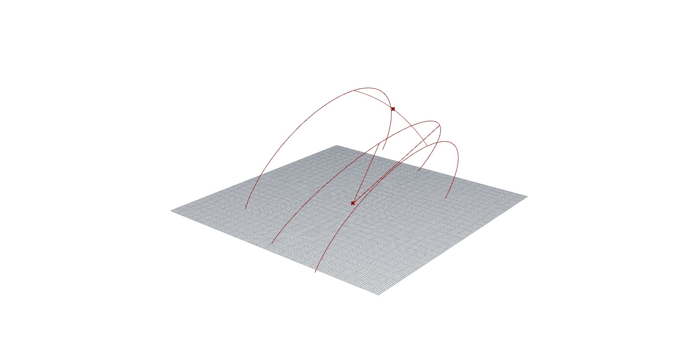

# Sunshade Generator (Geometric)
(NOTE: This repo was previously an archive of several gh files.
Each gh file is now individually uploaded, starting with this)

## Summary
Basic sunshade generator. 
Emphasis on ‘Geometric’: no equations involved in creating a solar path. 
Just simulating a sun path in 3D using curves, parameters on curves, and lines. 

## Usage
Open in Rhino 8, via Grasshopper in command line

## Description of Procedure 
Generates an overhang and vertical fins based on sun angles.

The length of the overhang is set by the overhead sun angle.
The length of the fins is set by the horizontal sun angle. 
Fin spacing is adjustable, while still adjusting to horizontal sun angle. 

The thicknesses of the overhang and fins are adjustable. 

The sun and angles are modeled as follows:

### Angles/Lines
1) Sun path: Form a scalable semicircle on origin. Oriented on XZ axis, points terminating on XY plane.

2) Declination Range: Draw two lines from the origin to the midpoint of this semicircle. Rotate each line 23.5 degrees and -23.5 degrees, respectively, along the YZ axis.

3) Date Points: Parametrise arc for length corresponding to 24 hours. Set two adjustable points, indicating two points in time.

4) Latitude: Simulate latitude by setting rotation parameters for previous elements.

5) Declination: Parametrise small arc for length corresponding to 180 days. This makes it possible to adjust declination based on days. 

### Modelling

6) Surface: Create a box centred on the origin and adjust its dimensions. Project sun path onto origin by forming a surface where it intersects the box.  

7) Overhang: Set a target z-height above the intersection, and form a horizontal plane intersecting the box. This is the height of the overhang.

8) Fin spacing: From the lesser of two solar angles, get the x-value (cosine). Divide the overhang by this value. 
Fin extent: Draw lines to direction of overhang from points

9) Extrusion: Extrude fins (from center) and overhang upwards

10)  Scaling: Set a division parameter to scale fin distance/length while keeping proportions consistent. 

## Log

### 05/08/24
Readme images added. Noting file to be debugged/cleaned for final version.

### 04/08/24
Redone and simplified entire gh file. Readme updated.
Old file in local.

### 29/10/23
solar_path gh lines for dates added (Declination).

### 25/09/2023
IMPORTANT: Last log superseded. Corrections canceled. 
solar_path gh nearly complete. All base equations working. 

### 01/08/2023
IMPORTANT: Printed equations from reference are incorrect. Noting all corrected equations:

rs = r x cosDEC / (sinLAT + sinDEC) => LAT replaced ALT
rh = r * cosLAT * sinHRA => r is multiplied by LAT and HRA, not divided. 

###
ENTIRE base equation FIXED. Important: Original source ref was wrong.
Proper reference: Szokolay, Thermal Design of Buildings (1987).

###
solar_path rs and ds visualisation fixed!

### 09/04/2023
solar_path gh ALT value fixed. Fixing ds and rs values. 

### 24/12/2022
parabola_project updated and working beautifully. 

### 18/12/2022
Added parabola_project.

### 11/12/2022
First upload.

